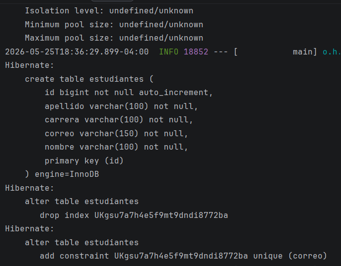
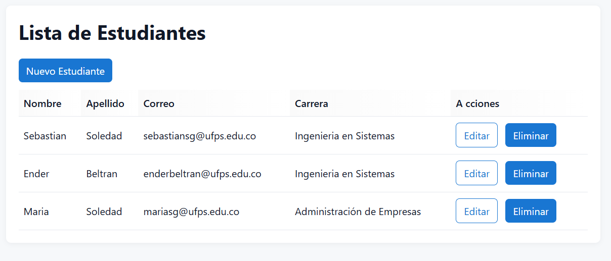
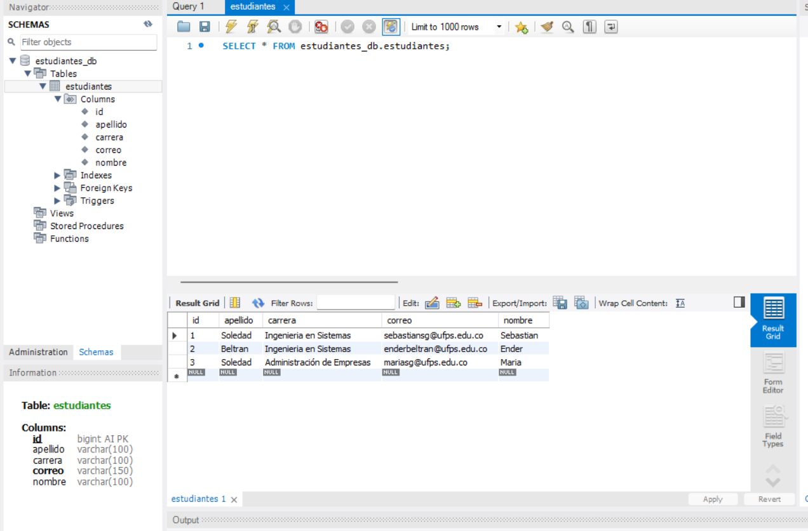
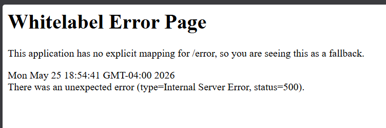
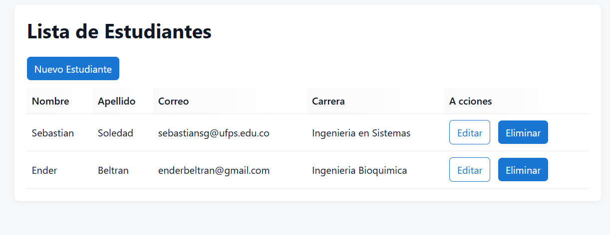

# Estudiantes — CRUD con Spring Boot, Thymeleaf y MySQL

Proyecto de ejemplo que implementa un CRUD para la entidad Estudiante usando Spring Boot, Spring Data JPA, Hibernate, Thymeleaf y MySQL.

## Contenido
- `/src/main/java` — código Java (controller, service, repository, model)
- `/src/main/resources/templates/estudiantes` — vistas Thymeleaf
- `/src/main/resources/static/css/styles.css` — estilos aplicados a las vistas
- `docs/screenshots` — capturas de pantalla del proyecto (lista en la sección "Screenshots")

## Requisitos
- Java 17 (JDK)
- Maven (se incluye wrapper: `mvnw.cmd`)
- MySQL 8 (opcional: H2 para desarrollo)

## Configuración de MySQL (crear base de datos y usuario)
1. Arranca el servicio MySQL en Windows (ejecuta PowerShell como Administrador si es necesario):

```powershell
# iniciar servicio (si el servicio se llama MySQL80)
Start-Service -Name MySQL80
Test-NetConnection -ComputerName localhost -Port 3306
```

2. Conéctate con MySQL Workbench o mysql client como `root` y ejecuta:

```sql
CREATE DATABASE IF NOT EXISTS estudiantes_db
  CHARACTER SET utf8mb4
  COLLATE utf8mb4_unicode_ci;

-- Crear usuario con plugin mysql_native_password (recomendado para desarrollo)
CREATE USER IF NOT EXISTS 'appuser'@'localhost' IDENTIFIED WITH mysql_native_password BY 'apppass';
GRANT ALL PRIVILEGES ON estudiantes_db.* TO 'appuser'@'localhost';
FLUSH PRIVILEGES;
```

3. Verifica plugin del usuario (opcional):

```sql
SELECT user, host, plugin FROM mysql.user WHERE user = 'appuser';
```

## Configuración en `application.properties`
Edita `src/main/resources/application.properties` y ajusta las credenciales si es necesario. Ejemplo usado en este proyecto:

```properties
spring.datasource.url=jdbc:mysql://localhost:3306/estudiantes_db?useSSL=false&serverTimezone=UTC
spring.datasource.username=appuser
spring.datasource.password=apppass
spring.datasource.driver-class-name=com.mysql.cj.jdbc.Driver

spring.jpa.hibernate.ddl-auto=update
spring.jpa.show-sql=true
spring.jpa.properties.hibernate.format_sql=true
# spring.jpa.database-platform can be omitted; Hibernate detecta el dialect automáticamente
server.port=8080
```

Si recibes el error "Public Key Retrieval is not allowed" puedes:
- Añadir `&allowPublicKeyRetrieval=true` a la URL JDBC (rápido, solo desarrollo):
  `jdbc:mysql://localhost:3306/estudiantes_db?useSSL=false&serverTimezone=UTC&allowPublicKeyRetrieval=true`
- O mejor: cambiar el plugin del usuario a `mysql_native_password` (ver SQL arriba).

## Compilar y ejecutar
Nota: necesitas Java 17 en `PATH`/`JAVA_HOME` para ejecutar el JAR generado.

Empaquetar:
```powershell
.\mvnw.cmd -DskipTests package
```

Ejecutar JAR:
```powershell
java -jar target\estudiantes-0.0.1-SNAPSHOT.jar
```

O ejecutar con Maven (si tu mvn usa JDK 17):
```powershell
.\mvnw.cmd spring-boot:run
```

## Rutas principales
- Lista: `http://localhost:8080/estudiantes`
- Nuevo: `http://localhost:8080/estudiantes/nuevo`

## Ubicación de vistas y CSS
- Plantillas Thymeleaf: `src/main/resources/templates/estudiantes`
- CSS estático: `src/main/resources/static/css/styles.css` — ya enlazado desde las vistas

## Screenshots
Las capturas de pantalla del proyecto están en `docs/screenshots`. Abre esa carpeta en el explorador o en tu editor para ver los archivos. Ejemplos:

- docs/screenshots/tablas-consola.png
- docs/screenshots/estudiantes-creados.png
- docs/screenshots/estudiantes-creados-db.png








## Errores comunes y cómo resolverlos
- The connection property 'useSSL' ... The value '' is not acceptable: revisa que la URL JDBC esté en UNA sola línea y que `useSSL` tenga un valor (`true`/`false`).
- Communications link failure / Connection refused: MySQL no está en ejecución, puerto bloqueado o servidor escucha en otra IP/puerto. Arranca el servicio y usa `Test-NetConnection`.
- Public Key Retrieval is not allowed: añadir `allowPublicKeyRetrieval=true` en la URL (dev) o cambiar plugin de usuario a `mysql_native_password`.
- UnsupportedClassVersionError: necesitas Java 17+ (el proyecto está configurado para Java 17 en `pom.xml`).

## Buenas prácticas
- No dejes `allowPublicKeyRetrieval=true` en producción sin asegurar la conexión (usa SSL/TLS o credenciales seguras).
- Usa usuarios con permisos mínimos en producción.

## Contribuir
- Puedes sumar estilos, validaciones en frontend o internacionalización. Sigue la estructura por capas (controller/service/repository/model) y las convenciones Java/Thymeleaf existentes.


